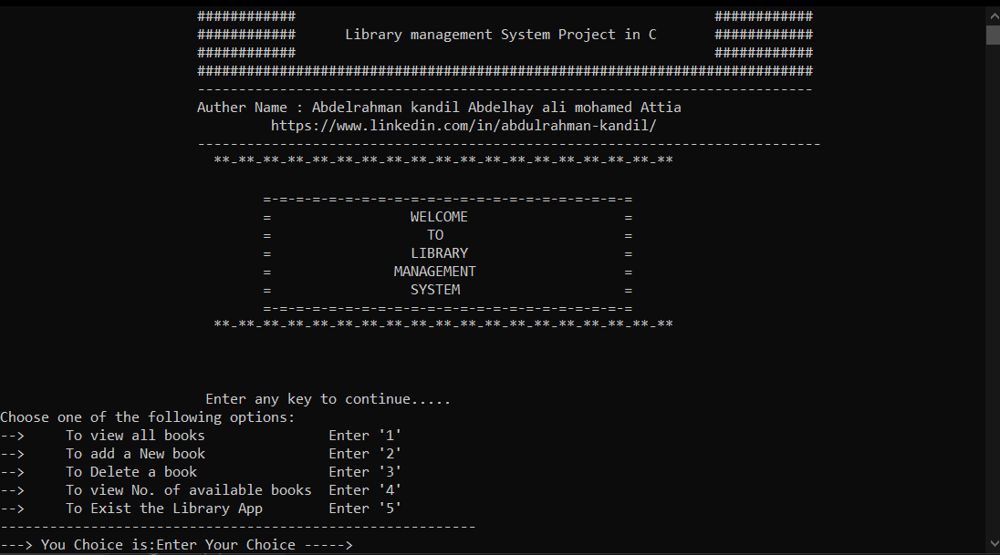

# Library  Management System 

 > This is A software for Library information management system using data structure linked list & FIFO buffer.
 

 ## Library Features (2024)

- View all books
- Add New Book
- Delete a Book
- View Number of avilable books
- Exist the Library App

## Built With

- C Programming
- Linked List  structure & FIFO Buffer

## Getting Started

To get started with this project you need Download the [zip folder](https://github.com/AbdelrahmanKandil/Library-Management-System-/archive/refs/heads/main.zip) of this repository
and run the [a.exe](a.exe) file or  run the [main.c](main.c) file using gcc .

## 🔗 Links

## Show your support

Give a ⭐️ if you like this project!

## Authors

👨‍💻 **Abdelrahman Kandil**
## Feedback

If you have any feedback, please reach out to me at   

